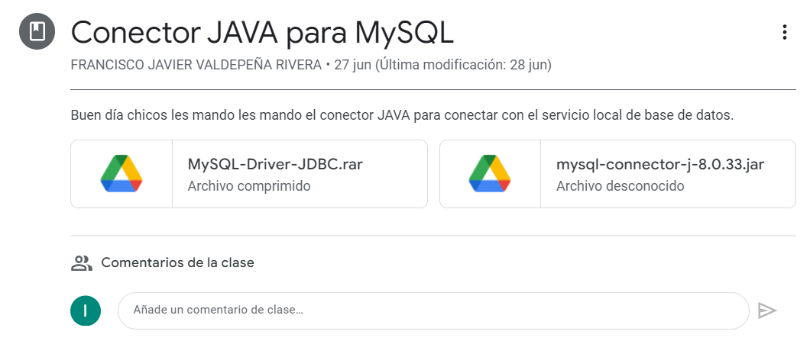
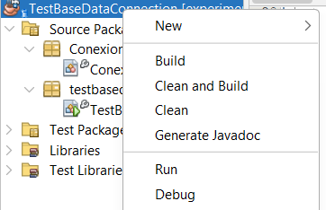
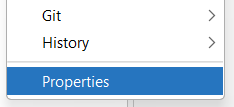
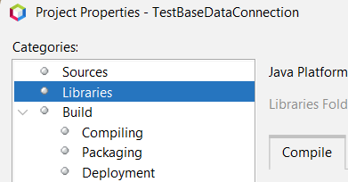
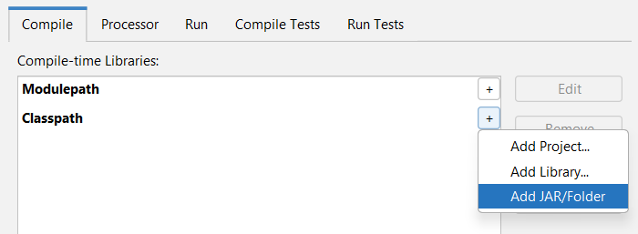
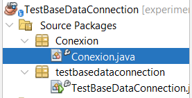
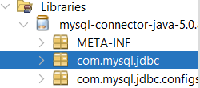
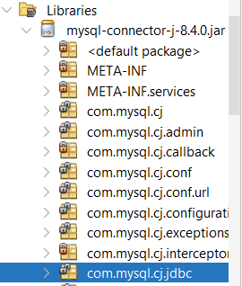

# HOW TO CREATE A DATA BASE CONNECTION WITH JAVA

## INDEX

- [HOW TO CREATE A DATA BASE CONNECTION WITH JAVA](#how-to-create-a-data-base-connection-with-java)
  - [INDEX](#index)
  - [DOWNLOAD AND UPLOAD DRIVER](#download-and-upload-driver)
  - [DRIVER CONFIGURATION. `Conexion` CLASS](#driver-configuration-conexion-class)
    - [JavaToSQL Method](#javatosql-method)
      - [`Class.forName`](#classforname)
      - [`Connection info`](#connection-info)
      - [`DriverManager.getConnection`](#drivermanagergetconnection)
    - [The Rest Of The Variables](#the-rest-of-the-variables)
  - [MAIN CLASS (`TestBaseDataConnection`)](#main-class-testbasedataconnection)


<br>

## DOWNLOAD AND UPLOAD DRIVER

First of all, we need to download the Java driver that will let us to use MySQL commands with Java code.

The teacher provides us with two different driver versions, 5.0.8 and 8.0.33 (or you can look for it on the internet). Whatever you choose is right, it just changes a code line from the driver configuration. Not a big deal.



Once you're done, it's time for uploading that driver into your Netbeans project. You can do that by:

1. Left clicking in your project



2. Then click on 'properties'



3. Select the 'Libraries' category



4. And in the 'Classpath' option, select the .JAR file you just downloaded <sup>1</sup>

 **Note 1:** the .JAR file can be inside the folder you downloaded



5. Driver is loaded!, now close window.

<br>
<br>

(Return to [index](#index))

<br>

## DRIVER CONFIGURATION. `Conexion` CLASS

Now it's time to configure the driver in order to get access to one of our Data Bases (DB). So we gonna need to specify information like port, DB name, user, password, etc.

That information will be stored in our method `JavaToSQL` (from `Conexion` class).



### JavaToSQL Method

#### `Class.forName` 

It loads the driver. What we are doing here is literally telling which class we're gonna use (this must be done since we're using a external library)

**Note:** This code line depends on which driver version we're using, because the "class name" or "class direction" is different.

```java

    Class.forName("com.mysql.jdbc.Driver"); // 5.0.8 Driver version

```




or

```java
    
    Class.forName("com.mysql.cj.jdbc.Driver"); // 8.4 Driver version

```


#### `Connection info`

Here we only set the DB info in *Strings*.

```java

    String servidor = "jdbc:mysql://localhost:3307/practica1";

```

- `jdbc:mysql://` -> The driver name
- `localhost:` -> The IP direction
- `3307` -> The port direction (usually 3306)
- `practica1` -> The DB name


```java

    String usuario = "root";
    String password = "";

```

#### `DriverManager.getConnection`

In this part we need some libraries, `import java.sql.Connection` and `
import java.sql.DriverManager` to be more specific.

*Connection* is used for our `conexion` variable. This is our bridge between Java and MySQL.

```java
    public Connection conexion = null;
```

In this example, our variable is public since we're gonna use it in our main class.

---
<br>

And we use a *DriverManager* method to get the connection with the Connection info we just set:

```java
    conexion = DriverManager.getConnection(servidor, usuario, password);
```

And that's practically all from this method.

<br>

### The Rest Of The Variables

In this class we have two more variables: `comando` and `registro`. Each one requires its own import statement: `import java.sql.Statement` and `import java.sql.ResulSet`.

```java

    public Statement comando = null;
    
    public ResultSet registro;

```

- `comando`: We're gonna use this one to send SQL commands to our DB
- `registro`: And this is to save our results from the SQL commands

<br>
<br>

(Return to [index](#index))

<br>

## MAIN CLASS (`TestBaseDataConnection`)

Inside of our `try-catch`, we create a *Conexion* variable:

```java
    Conexion conector = new Conexion();
```

Now we call our `JavaToSQL` method. If you remember, this will load our "*conexion*" variable with *DriverManager.getConnection*. So if it works, *conexion* will not be `null` anymore and will be ready to be used; else, it goes to catch.

```java
    conector.JavaToMySQL();
```

Then, we prepare our query with Strings

```java
    String tabla = "persona";
    String query = "select * from "+tabla;  
```

Also we prepare the "*comando*" variable. As we saw before, it is `null`, but we can't work with nulls, so we create a Statement object by using `createStatement()`

```java
    conector.comando = conector.conexion.createStatement();
```

And we execute the query. The query result will be saved in our "*registro*" variable.

```java

    conector.registro = conector.comando.executeQuery(query);

```

Finally, we print our results. `getString(columnIndex)` retrieves the value of the designated column

```java
    while(conector.registro.next()){
            System.out.println(conector.registro.getString(1)+" "+conector.registro.getString(2)+" "+conector.registro.getString(3));
        }
```

And that's all.

<br>
<br>

(Return to [index](#index))

<br>